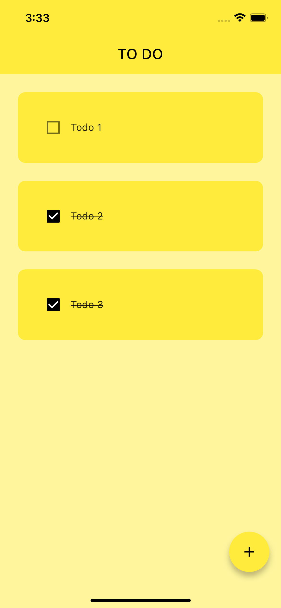
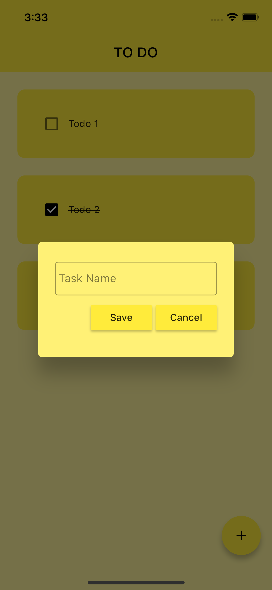

# Mental Health App

<div class="image-row">
    
    <div class="image-space"></div>
    

</div>

## Description

The Todo App is a Flutter application designed to provide support and resources for todo list.

## Installation

1. Clone the repository:

   ```bash
   git clone https://github.com/huyquang-bka/to_do_app.git
   ```

2. Install the dependencies:

   ```bash
    flutter pub get
   ```

3. Run the app:

   ```bash
    flutter run
   ```

## Technologies

- Flutter
- Dart
